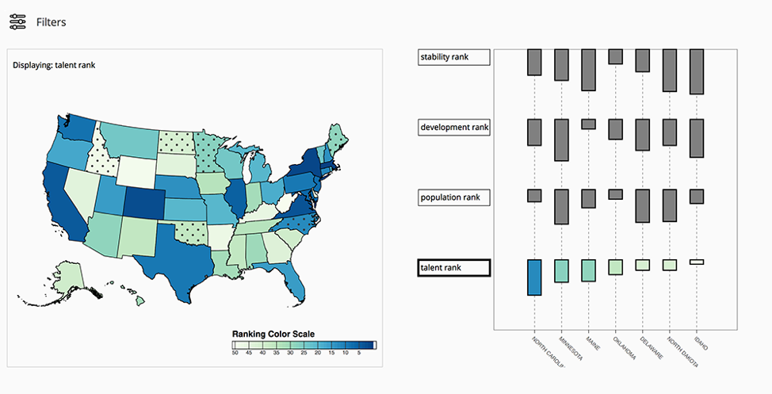

# How do companies pick a location for their headquarters?

This repository contains the code for the visualization project for the Data Visualization class (IN4086-14) at TU Delft. We developed a visualization system that helps answer the question "How do companies pick a location for their headquarters?". The data was obtained by processing and aggregating multiple sources with Python. The visualizations were made with d3js and javascript. Some screenshots of the resulting tool can be seen below.

### System overview 

